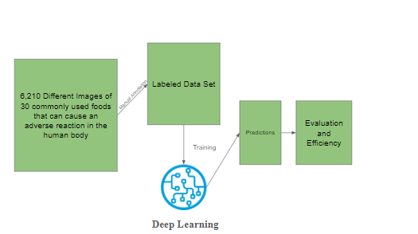
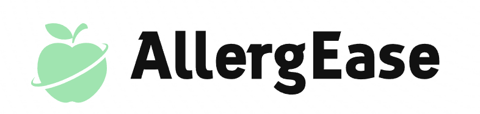

<a name="readme-top"></a>


<!-- PROJECT LOGO -->
<br />
<div align="center">

  <h3 align="center">AllergEase - Your Personal Allergy Detection Assistant</h3>
  

<!-- TABLE OF CONTENTS -->
<details>
  <summary>Table of Contents</summary>
  <ol>
    <li>
      <a href="#about-the-project">About The Project</a>
      <ul>
        <li><a href="#built-with">Built With</a></li>
      </ul>
    </li>
    <li>
      <a href="#getting-started">Getting Started</a>
      <ul>
        <li><a href="#prerequisites">Prerequisites</a></li>
        <li><a href="#installation">Installation</a></li>
      </ul>
    </li>
    <li><a href="#usage">Usage</a></li>
    <li><a href="#roadmap">Roadmap</a></li>
    <li><a href="#contributing">Contributing</a></li>
    <li><a href="#license">License</a></li>
    <li><a href="#contact">Contact</a></li>
  </ol>
</details>


<!-- ABOUT THE PROJECT -->
## About The Project

<a href="https://studyboat.netlify.app">
    
</a>

The project is designed for food allergy identification, leveraging state-of-the-art Deep Neural Network (DNN) models to classify images associated with food products. With a primary goal of enhancing food safety, the system aids in automating the detection of potential allergens in various food items, contributing to the prevention of allergic reactions.

## Key Features:

### Automated Allergen Detection:
The core functionality revolves around the automated identification of potential allergens present in food products.
Deep Learning Architecture:
Utilizes a Convolutional Neural Network (CNN) architecture, specifically a Deep Neural Network (DNN) model, to effectively learn and recognize patterns associated with allergenic ingredients in images.

### Image Preprocessing:
Implements robust image preprocessing techniques to ensure standardized input for the model, enhancing the accuracy and reliability of allergen identification.

### Data Sets and Training:
Leverages diverse datasets, including reports from Massachusetts General Hospital and Brigham and Women's Hospital, to train and validate the DNN model. This comprehensive approach ensures the model's proficiency in identifying allergens across various contexts.

### Generalizability and Reproducibility Testing:
Evaluates the model's generalizability to new cases within the same hospital and reproducibility when applied to data from a different hospital. This extensive testing enhances the reliability of the system.

### Severity Classification:
Includes a severity classification mechanism to categorize allergic events into different levels, providing additional insights into the potential harm associated with identified allergens.

### Attention Mechanism Interpretation:
Incorporates an attention-based DNN layer that assigns weights to individual words, aiding in the interpretation of the model's predictions. High-attention words contribute to the extraction of meaningful insights.

### Comparison with Keyword-Search Approach:
Compares the performance of the deep learning approach with a conventional keyword-search method in terms of manual review effort and positive case yield, contributing to a holistic assessment of the system's effectiveness.

In summary, the project serves as a sophisticated tool for automating the detection of allergens in food items, offering a valuable contribution to food safety practices and the prevention of allergic reactions. Its features encompass advanced deep learning techniques, extensive testing, and interpretability mechanisms, ensuring a robust and reliable solution for allergen identification.


 ### Accomplishments

* Deployed to production (Access at https://studyboat.netlify.app)
* High scalability due to GPT API
* Powerful and light notes generating AI/Machine Learning Model


<p align="right">(<a href="#readme-top">back to top</a>)</p>


### Built With

* Google Colab
* Netlify

<p align="right">(<a href="#readme-top">back to top</a>)</p>


<!-- GETTING STARTED -->
## Getting Started

Get started with AllergEase

### Prerequisites

First install node.
* npm
  ```sh
  npm install npm@latest -g
  ```

### Installation

_Below is an example of how you can instruct your audience on installing and setting up your app. This template doesn't rely on any external dependencies or services._

1. Get a free API Key at [https://openai.com/blog/openai-api](https://openai.com/blog/openai-api)
2. Clone the repo
   ```sh
   git clone https://github.com/nkgroot2007/AllergEase.git
   ```
3. Install NPM packages
   ```sh
   npm install
   ```
4. Install python requirements
    ```sh
    pip install -r requirements.txt
    ```

<p align="right">(<a href="#readme-top">back to top</a>)</p>


<!-- USAGE EXAMPLES -->
## Usage

* Follow the text inputs on the web page and get results immediately
* Project demo available at [https://studyboat.netlify.app](https://studyboat.netlify.app)

<p align="right">(<a href="#readme-top">back to top</a>)</p>


<!-- ROADMAP -->
## Roadmap

- [x] Build Flask API
- [x] Build Frontend-basic
- [x] Deploy API to Render
- [x] Deploy Frontend-basic to Github Pages
- [ ] Further enhancements
    - [ ] UI
    - [ ] Explore and Enhance the Existing Model

See the [open issues](https://github.com/nkgroot2007/AllergEase/issues) for a full list of proposed features (and known issues).

<p align="right">(<a href="#readme-top">back to top</a>)</p>


<!-- CONTACT -->
## Contact

* Nikhil Kumar - [LinkedIn](https://www.linkedin.com/in/nikhil-kumar-599485285/) - nkgroot2007@gmail.com
* Shlesh Sakpal - [LinkedIn](https://www.linkedin.com/in/shlesh/) - shleshsakpal@gmail.com

* Project Link: [https://github.com/nkgroot2007/AllergEase](https://github.com/nkgroot2007/AllergEase)
* Project Demo: [https://studyboat.netlify.app/](https://studyboat.netlify.app/)

<p align="right">(<a href="#readme-top">back to top</a>)</p>


